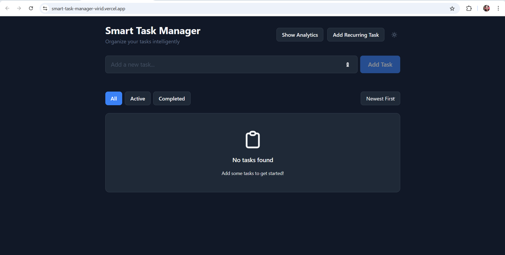

# 🧠 Smart Task Manager Dashboard

A fully responsive React app that helps users manage tasks efficiently using advanced React Hooks and custom features.

## 📸 App Screenshot
<div align="center">
  
</div>

## 🚀 Live Demo
[View Deployed App](https://smart-task-manager-virid.vercel.app/)

## 📁 Features

- Add, edit, delete tasks
- Mark tasks as completed
- Auto-categorization by keywords (e.g., Work, Urgent)
- Recurring tasks (daily, weekly, monthly)
- Voice input for quick task addition
- Dark/Light theme toggle with system preference detection
- Drag-and-drop task reordering
- Modern UI with smooth animations
- Auto-save to localStorage
- Progress tracking and task filtering
- Responsive design for all devices

## ⚙️ React Hooks Used

| Hook            | Use Case 1                              | Use Case 2                            |
|-----------------|------------------------------------------|----------------------------------------|
| `useState`      | Store task list                          | Toggle task completion                 |
| `useEffect`     | Load tasks on mount                      | Sync tasks to localStorage             |
| `useReducer`    | Manage task list                         | Handle task categories                 |
| `useRef`        | Focus task input                         | Voice input management                 |
| `useContext`    | Theme toggle via `ThemeContext`          | Task stats via `TaskStatsContext`      |
| `useMemo`       | Filtered tasks                           | Task statistics                        |
| `useCallback`   | Add/remove task handlers                 | Voice input controls                   |
| `useLayoutEffect`| Scroll to new task                      | Theme transitions                      |

### 🧩 Custom Hooks

- `useLocalStorage`: Persistent state management with localStorage
- `useVoiceInput`: Voice recognition integration for task input
- `useTaskCategories`: Auto-categorization of tasks based on content

## 🛠️ Tech Stack

- React 18 with Hooks
- Tailwind CSS for styling
- Framer Motion for animations
- @dnd-kit for drag and drop
- Web Speech API for voice input
- Vercel for deployment
- GitHub for version control

## 📦 Installation & Local Setup

1. Clone the repository:
   ```bash
   git clone https://github.com/sheethal5shivakumar/Smart-Task-Manager.git
   ```

2. Navigate to the project directory:
   ```bash
   cd Smart-Task-Manager
   ```

3. Install dependencies:
   ```bash
   npm install
   ```

4. Start the development server:
   ```bash
   npm start
   ```

5. Open [http://localhost:3000](http://localhost:3000) to view it in your browser.

## 🚀 Deployment

The app is deployed on Vercel. For deploying your own version:

1. Fork this repository
2. Create a Vercel account
3. Connect your GitHub repository to Vercel
4. Deploy with a single click

## 📝 License

MIT License - feel free to use this project for learning or as a base for your own task manager! 